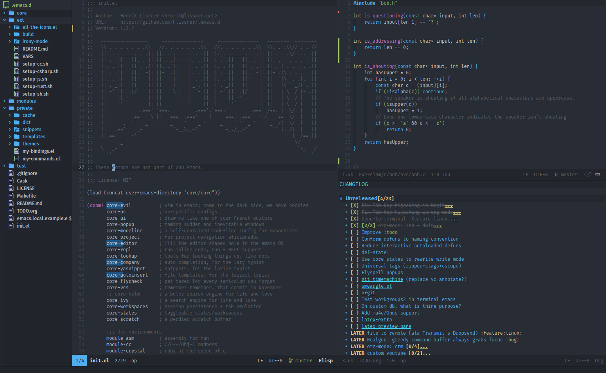
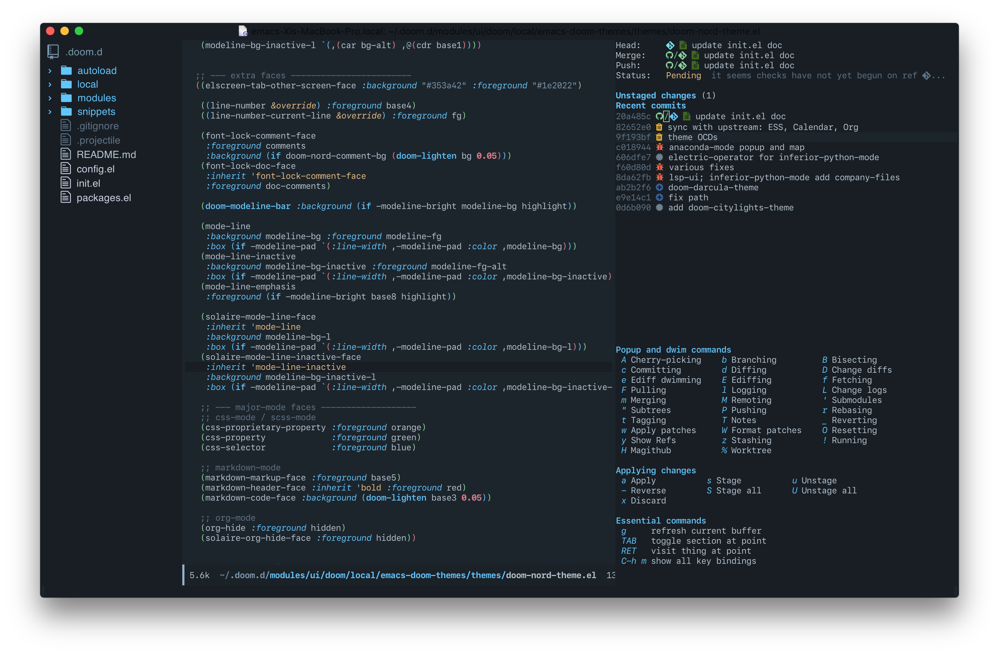
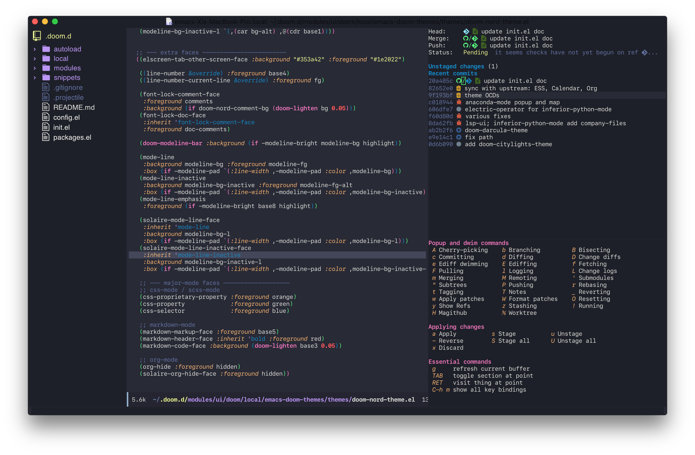
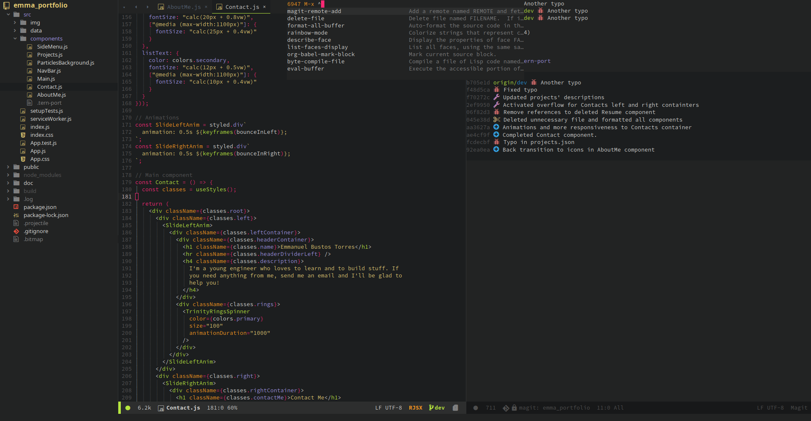
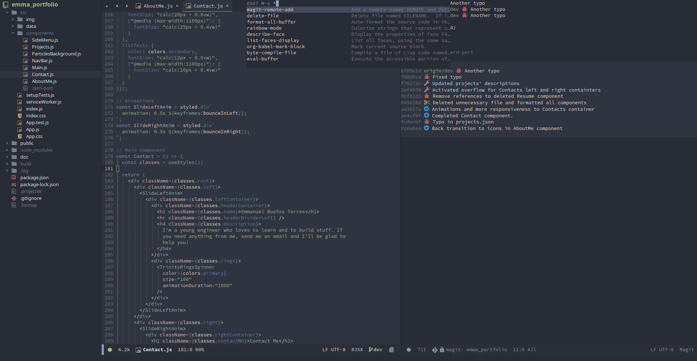
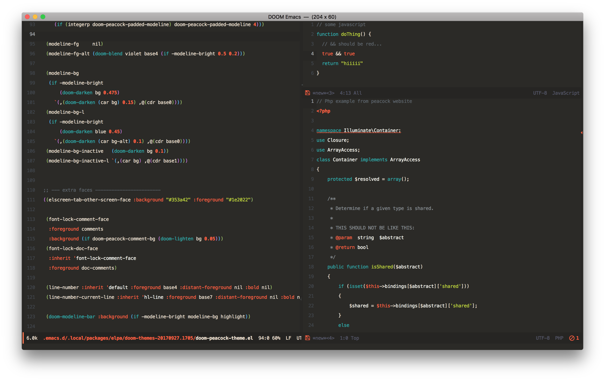
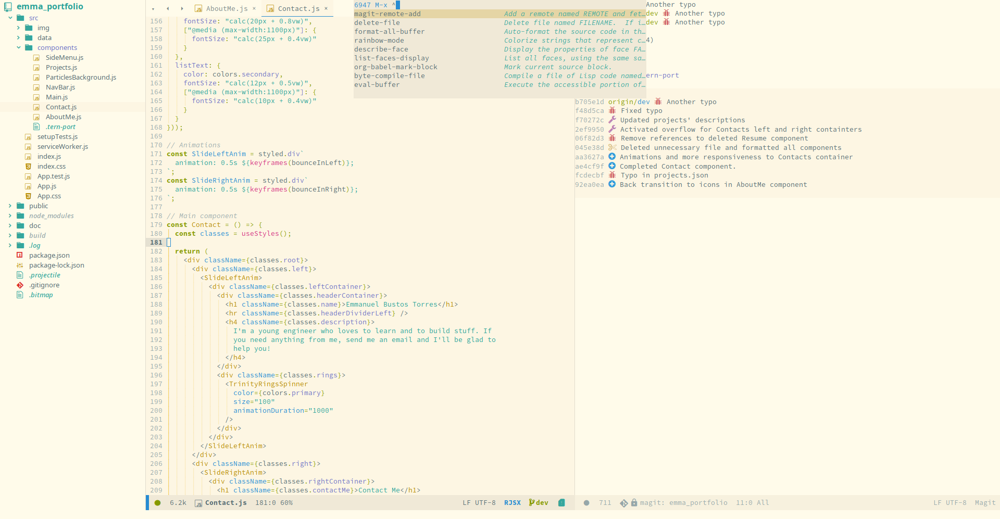
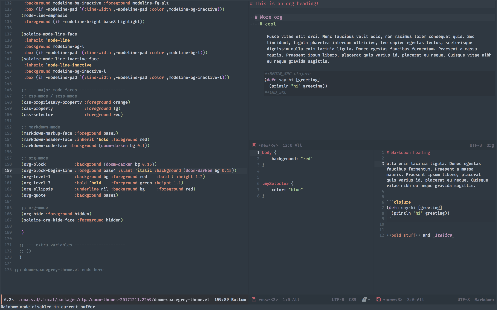

# Screenshots

<!-- markdown-toc start - Don't edit this section. Run M-x markdown-toc-refresh-toc -->
**Table of Contents**

- [Screenshots](#screenshots)
    - [Flagship Themes](#flagship-themes)
        - [doom-one](#doom-one)
    - [Additional Themes](#additional-themes)
        - [doom-citylights](#doom-citylights)
        - [doom-darcula](#doom-darcula)
        - [doom-molokai](#doom-molokai)
        - [doom-nord](#doom-nord)
        - [doom-solarized-light](#doom-solarized-light)
        - [doom-spacegrey](#doom-spacegrey)

<!-- markdown-toc end -->

## Flagship Themes

### doom-one

### doom-one-light (WIP)

## Additional Themes

### doom-citylights

### doom-darcula

### doom-molokai

### doom-nord

### doom-nova (WIP)

### doom-peacock

### doom-solarized-light

### doom-spacegrey

### doom-tomorrow-night (WIP)

### doom-vibrant (WIP)
